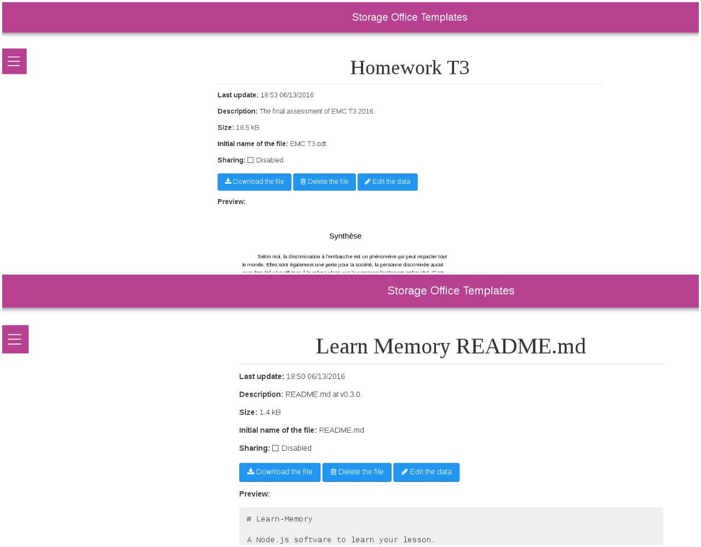

# storage-office-templates
A web application to store the office file templates.

[](https://travis-ci.org/cedced19/storage-office-templates)
[](http://badge.fury.io/js/storage-office-templates)



## CLI

```bash
$ npm install storage-office-templates -g
```

Go in command line to the directory where you have your save.

```bash
$ storage-office-templates
```

## Server

```bash
$ git clone --depth=1 https://github.com/cedced19/storage-office-templates
$ cd ./storage-office-templates
$ npm install --production
$ npm start --production
```

## API

There are Rest API on:
* `http://localhost:8880/api/files/` for files
* `http://localhost:8880/api/users/` for users
* `http://localhost:8880/api/registrants/` for registrants (a person who intends to be an user)

## Developers

There are two npm commands with which you can compile javascript:
* `npm run dev`: reload page on change and build bundle
* `npm run prod`: build and uglify bundle
